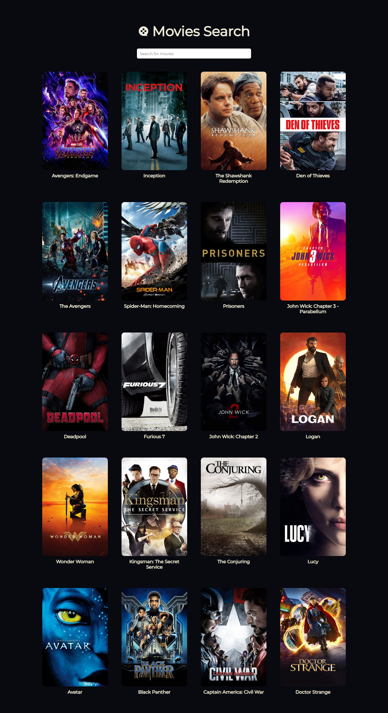
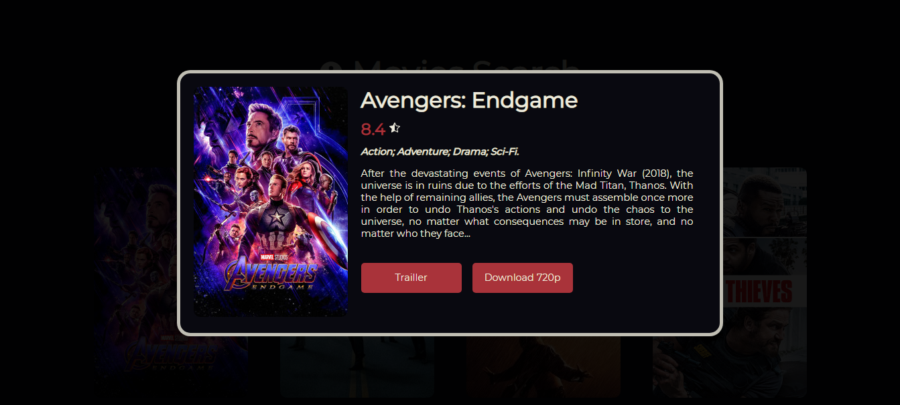

<h1 align="center"> MovieSearch </h1>

## Login

[Preview](https://movies-search-r0kc7pvct-lucaslomeu.vercel.app/)

 

<h1 align="center">
  
  
</h1>

 

## 🚀 Tecnologias

Esse projeto foi desenvolvido com as seguintes tecnologias:

- ReactJs
- SASS

## 💻 Projeto

Foi desenvolvido um site de busca de filmes utilizando a api [YTS](https://yts.mx/api), onde é possível obter informações e até mesmo realizar o download via torrent.

## Rodando o Projeto

No diretório, você utiliza o comando:

### `yarn start`

Abra [http://localhost:3000](http://localhost:3000) para ver no seu navegador.
