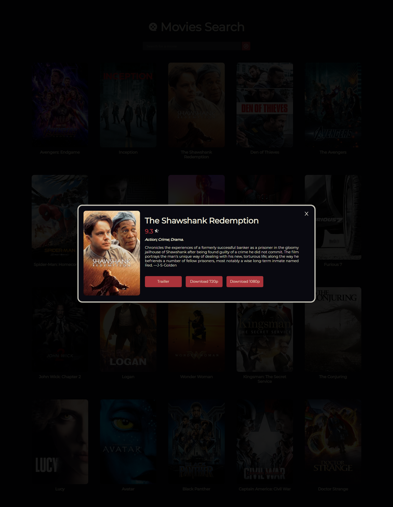

<h1 align="center"> MovieSearch </h1>

Confira o [Preview](https://movies-search-azure.vercel.app/) desse projeto!

<br>

<h1 align="center">
  
  
</h1>

<br>

## 💻 Projeto

Foi desenvolvido um site de busca de filmes utilizando a api [YTS](https://yts.mx/api), onde é possível obter informações e até mesmo realizar o download via torrent.

### 🚀 Tecnologias

As seguintes ferramentas foram usadas na construção do projeto:

- [Node.js](https://nodejs.org/en/)
- [React](https://pt-br.reactjs.org/)
- [SASS](https://sass-lang.com/)

```bash
# Clone este repositório
$ git clone <https://github.com/lucaslomeu/movies-search>

# Acesse a pasta do projeto no terminal/cmd
$ cd movies-search

# Instale as dependências
$ npm install ou
$ yarn add
```

Abra [http://localhost:3000](http://localhost:3000) para ver no seu navegador.
